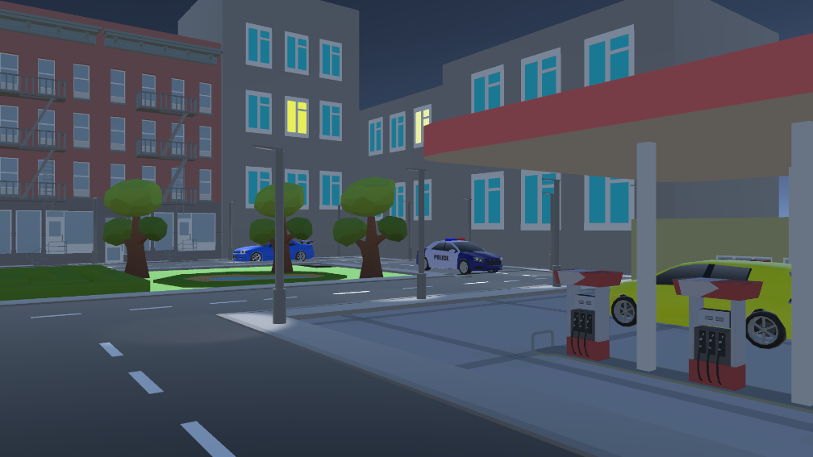

<h1>Практическое задание: создание сцены в Unity</h1>

<figure>
   
   <figcaption>
     Рисунок 1 - Скриншот сцены: ракурс 1
   </figcaption>
</figure>

<figure>
   
   <figcaption>
     Рисунок 2 - Скриншот сцены: ракурс 2
   </figcaption>
</figure>

<figure>
   
   <figcaption>
     Рисунок 3 - Скриншот сцены: ракурс 3
   </figcaption>
</figure>

<figure>
   
   <figcaption>
     Рисунок 4 - Скриншот сцены: ракурс 4
   </figcaption>
</figure>

<figure>
   
   <figcaption>
     Рисунок 5 - Скриншот сцены: ракурс 5
   </figcaption>
</figure>

<figure>
   
   <figcaption>
     Рисунок 6 - Скриншот сцены: ракурс 6
   </figcaption>
</figure>

